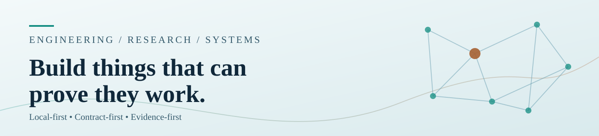
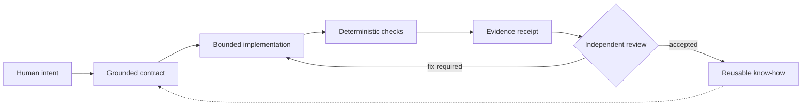

<div align="center">

<picture>
  <source media="(prefers-color-scheme: dark)" srcset="assets/hero-dark.svg">
  
</picture>

<h3>Solution Architecture · AI Systems · Full-Stack · DevSecOps</h3>

<p><strong>From human intent to evidence-backed software.</strong></p>

<p><a href="#the-approach">The approach</a> &nbsp;·&nbsp; <a href="#what-i-build">What I build</a> &nbsp;·&nbsp; <a href="#evidence-board">Evidence board</a> &nbsp;·&nbsp; <a href="#roadmap">Roadmap</a></p>

</div>

> **Public data notice:** metrics below are a *dated snapshot (2026-09-03)*, not live product-health measurements. No private repository topology or live API calls are exposed.

## ✨ The approach

Products, agent workflows and development environments are easier to trust when **an action, its authorization and its evidence are separate things**. My engineering practice treats every software change as a small, reviewable experiment rather than a milestone claimed by narrative.

`intent → contract → smallest implementation → tests → independent evidence → learning`

| 🧭 Design for reuse | ⚙️ Build deliberately | 🧪 Verify reality | 🔒 Preserve control |
|:--|:--|:--|:--|
| Reuse first; new abstractions must pay for themselves | A bounded change with a reproducible input | No completion from a status label alone | Human approval and the source owner remain authoritative |

## 🧩 What I build

| Capability domain | Engineering focus |
|:--|:--|
| 🧭 **Engineering Fabric** | portfolio contracts, evidence, WorkGraph, integration morphisms |
| ⚡ **AI Routing** | provider abstraction, cost ranking, local-first fallback topology |
| 🛡️ **Control &amp; Automation** | authority-aware execution, task flow, bounded automation |
| 🧠 **Memory &amp; Knowledge** | context continuity, provenance, positive/negative know-how |
| 🗺️ **Spatial Interfaces** | 2D/3D graph projections, visual IDE and system navigation |
| 🧩 **Web &amp; WordPress** | enterprise CMS, WooCommerce, migration and automation tooling |
| 🔐 **Security &amp; DevOps** | supply-chain evidence, CI cost controls, observability, recovery |
| 🔬 **Research &amp; Semantics** | ontology, language, DSL/IR and evidence-driven exploration |

<details>
<summary><strong>My toolset and operating preferences</strong></summary>

TypeScript · Node.js · React/Next.js · Rust/Tauri · PHP/WordPress · Python · Docker · GitHub Actions.

Local-first; schema-first; readable docs; native Windows/Linux workflows; security, observability and cost controls before autonomy.

</details>

## 🛰️ Evidence board

**Snapshot 2026-09-03** · Evidence model: Actor · Capability · Contract · Evidence

| Observation | Reported value | Important boundary |
|:--|:--|:--|
| Repository inventory | **314/314** | Historical inventory baseline; not present-day fleet census |
| Coverage classification | **VERIFIED** | inventory baseline · 2026-09-01 |
| Product completion | **UNKNOWN** | Inventory coverage must not impersonate delivery readiness |

| Historical maturity lane | Gate visualization | Done / total | At snapshot |
|:--|:--|--:|:--|
| **Portfolio inventory** | `██████████` | **1/1** | VERIFIED |
| **AI routing federation** | `████████░░` | **4/5** | CONTRACT_READY · runtime NOT_RUN |
| **Evidence learning loop** | `████████░░` | **3/4** | ACTIVE |
| **Runtime observability** | `░░░░░░░░░░` | **0/3** | NOT_RUN |

These numbers come from explicit denominators in the committed public-safe snapshot, not from commit counts or marketing estimates. A later source change does not retroactively upgrade this historical report.

## 🗺️ Architecture at a glance



<details>
<summary><strong>Terminal view · the engineering loop</strong></summary>

```text
  HUMAN              ENGINEERING              EVIDENCE
  intent ──────────▶ bounded change ────────▶ exact revision
   ▲                        │                      │
   │                        ▼                      ▼
  learn ◀─────────── verify / review ◀────── immutable receipt

  reuse  >  configure  >  adapter  >  morph  >  rewrite
  capability ≠ authority  ·  artifact ≠ delivery  ·  status ≠ proof
```

</details>

## 🚀 Roadmap

The future roadmap is expressed as **verifiable stages**, not a promise of self-running AI today. The dated dashboard above documents historical partial progress only.

| Stage | Concrete acceptance evidence | Status here |
|:--|:--|:--|
| 01 · Ground | Provenance-linked input and bounded contract | Design principle |
| 02 · Build | Reproducible, isolated implementation | Per-project verification |
| 03 · Verify | Executed tests and independently attributable receipts | Per-project verification |
| 04 · Orchestrate | Scoped multi-agent handoff with explicit authority | Research direction |
| 05 · Learn | Reviewed outcomes become reusable knowledge | Research direction |

> To show a current release or deployment here, its source must be freshly observed, redacted for public use, and included in a new committed snapshot.

## 📎 Public dashboard contract

- README and its SVGs are **static, repository-local assets**: 0 third-party badges, scripts, analytics, or runtime API calls.
- The relative, accessible SVG banners adapt to light/dark appearance; static SVGs contain **no script, foreign content, animation or external references**.
- **No private repository names, internal project links, detailed task topology or provider credentials** are published here.
- Evidence classes remain distinct: a local test, an approved PR and a user-accepted delivery are not interchangeable.
- Snapshot age is explicit. Historical gate counts never imply current deployment or readiness.

<div align="center"><sub>Deterministically generated from a public-safe snapshot · observed 2026-09-03T20:33:00+03:00 · local rendering, zero third-party requests</sub></div>